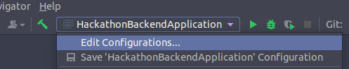

## :sparkles: Acessando a aplicação completa (front + back) :sparkles:

Antes de passarmos para as especificações técnicas, você pode ver a aplicação completa (front-end e back-end) funcionando! Para isso, acesse este link: :arrow_forward: [[Technical Share](https://technical-share.vercel.app/)] :arrow_backward:

Neste link, você encontra um vídeo de funcionalidades da aplicação completa: [Vídeo de funcionalidades]()

Neste link, você encontra o pitch da aplicação completa: [Vídeo do pitch](https://www.youtube.com/watch?v=9WcrornzdsE)

Agora, vamos aos trabalhos! :bulb:

________________

## Entendendo e executando a aplicação :rocket:

      

___________

## :orange: Aplicação Back-End para o Hackathon do Programa de Formação FCamara {Season 3} 

Este é o projeto da aplicação back-end desenvolvida para a etapa de Hackathon do Programa de Formação da empresa FCamara {Season 3}. Esta parte do projeto foi desenvolvida em Java, utilizando:

:leaves: Spring Framework, para configuração e padronização

:joystick: Spring Boot Tool, para facilitar a configuração e a publicação

:gear: Apache Maven, para gerenciamento de pacotes e plugins

:arrows_clockwise: JPA Framework com Hibernate, para criação e manipulação de tabelas

:bar_chart: PostgreSQL Database, para armazenamento de informações no banco de dados

:elephant: pgAdmin4, como interface gráfica do banco de dados

### :memo: Pré-requisitos e informações

____________________________________________________

Antes de mais nada, para executar e editar essa aplicação, você precisará de:

:space_invader: JDK (Java Development Kit)

<!-- No desenvolvimento do projeto, foi utilizado o openJDK em ambas as versões, 11.0.14.1 e 16.0.1 -->

:space_invader: Uma IDE Java instalada

<!-- No desenvolvimento do projeto, foi utilizado o IntelliJ -->

:space_invader: O banco de dados PostgreSQL instalado

Você pode utilizar também:

:space_invader: Uma interface gráfica para gerenciamento do banco de dados

<!-- No desenvolvimento do projeto, foi utilizada a pgAdmin4 e a DBeaver -->

:heavy_exclamation_mark: **Importante**:

Para acessar o Swagger da aplicação, o endereço http://localhost:8080/swagger-ui.html#/ deve ser colado na barra de endereço do navegador enquanto a aplicação estiver em execução na IDE.

### :wrench: Instalação

___

Não tem o OpenJDK instalado? Confira aqui alguns tutoriais que podem ser usados para fazer a instalação: 

:computer_mouse: [Instale o OpenJDK 11 no *Windows*](https://access.redhat.com/documentation/en-us/openjdk/11/html-single/installing_and_using_openjdk_11_for_windows/index#openjdk_for_windows_installation_options) ou [instale o OpenJDK 16 no *Windows*](https://www.codejava.net/java-se/download-and-install-openjdk-16)

:computer_mouse: [Instale o OpenJDK 11 ou 16 no *Ubuntu*](https://mkyong.com/java/how-to-install-java-jdk-on-ubuntu-linux/)

:computer_mouse: [Instale o OpenJDK 11 no macOS](https://techoral.com/blog/java/install-openjdk-11-on-mac.html) ou [Instale o OpenJDK 16 no macOS](https://codippa.com/install-openjdk16-macos/)

Já instalou o OpenJDK, mas ainda não tem uma IDE para começar a editar e executar os projetos? Confira a página de download e instalação do IntelliJ:

:computer_mouse: [Instale o IntelliJ no Windows](https://www.jetbrains.com/pt-br/idea/download/#section=windows)

:computer_mouse: [Instale o IntelliJ no Linux](https://www.jetbrains.com/pt-br/idea/download/#section=linux)

:computer_mouse: [Instale o IntelliJ no macOS](https://www.jetbrains.com/pt-br/idea/download/#section=mac)

Agora você tem o JDK e a IDE, mas talvez ainda não tenha o PostgreSQL. Aqui vão alguns tutoriais que podem ser úteis:

:computer_mouse: [Instale o PostgreSQL no Windows](https://www.digitalocean.com/community/tutorials/how-to-install-postgresql-on-ubuntu-20-04-quickstart-pt)

:computer_mouse: [Instale o PostgreSQL no Ubuntu](https://www.digitalocean.com/community/tutorials/how-to-install-postgresql-on-ubuntu-20-04-quickstart-pt)

:computer_mouse: [Instale o PostgreSQL no macOS](https://www.postgresql.org/download/macosx/)

Os tutoriais para Windows e Ubuntu também ensinam como criar seu primeiro banco de dados. Os tutoriais para Windows e macOS fornecem ainda a interface para manipular seus bancos. Se você estiver no Ubuntu, pode instalar o pgAdmin4 usando este tutorial:

:computer_mouse: [Instale o pgAdmin4 no Ubuntu](https://www.edivaldobrito.com.br/pgadmin4-no-ubuntu/)

A primeira coisa que você deve fazer após essas instalações é criar um banco de dados usando o PostgreSQL. Crie seu banco, dê um nome para ele e configure usuário e senha de acesso a este banco.

Em seguida abra a aplicação Java na IDE escolhida. Antes de executar, precisamos apenas configurar uma variável de ambiente. Se a sua IDE for o IntelliJ, você precisará ir até a parte superior central da IDE e clicar na seta que abre o menu de execução da aplicação, como mostrado na imagem a seguir.

O menu que abre deve mostrar a opção "Edit Configurations...". Clicando nesta opção, uma nova janela se abrirá e você vai procurar por "Environment variables". No campo referente a esta opção, cole este trecho:

`DATABASE_URL=jdbc:postgresql://localhost:5432/NOME_DO_BANCO?user=USUARIO_DO_BANCO&password=SENHA_DO_BANCO`

Agora é só dar ok e pronto: você está pronto ou pronta para executar a aplicação Java!

**:heavy_exclamation_mark:Importante**:

Na primeira vez que a aplicação for executada, você deve acessar o arquivo `application.properties`, na pasta `src/main/resources`, e realizar os seguintes procedimentos:

:keyboard: Coloque: `spring.jpa.hibernate.ddl-auto = true` 

:keyboard: Descomente: `spring.datasource.data=classpath:preenche_habilidade.sql`

Após executar a primeira vez, reverta essas modificações, colocando a primeira como `= update` e comentando a segunda.

### :computer: Detalhes da aplicação

_____

A aplicação contém quatro classes que são mapeadas como entidades para o banco de dados PostgreSQL. Toda a integração com o banco é feita utilizando JPA com Hibernate.

:bust_in_silhouette: A classe Usuario é responsável por armazenar as informações do usuário em uma entidade no banco de dados.

:triangular_flag_on_post: A classe Postagem é responsável por armazenar as postagens em uma entidade no banco de dados. Além disso, ela possui uma relação bidirecional com a classe Usuario, para conectar cada postagem ao usuário que a escreveu.

:pencil2: A classe Comentario é responsável por armazenar os comentários feitos em postagens em uma entidade no banco de dados. Ela possui uma relação unidirecional com a classe Usuário, para vincular um comentário ao usuário que o escreveu, e uma relação bidirecional com a classe Postagem, fazendo a ligação entre um comentário e a postagem a qual ele pertence.

:tennis: A classe Habilidade é responsável por armazenar no banco de dados as habilidades que os usuários da aplicação possam ter.

:bust_in_silhouette: :triangular_flag_on_post: :pencil2: :tennis: :passport_control: Todas as respectivas Controllers possuem os métodos GET e POST para suas Classes. Na Controller de Usuario, estão ainda métodos do tipo PUT que permitem que os usuário alterem alguns dados, enquanto que na de Postagem está incluído, um método que é capaz retornar as postagens de um usuário específico.

### :pushpin: Versão

_____

O controle de versionamento foi feito com o GIT.

### :black_nib: Autores 

______

:eight_spoked_asterisk: **Sarita Rimes** - *Desenvolvedora responsável pela construção e configuração da aplicação* - [SaritaRimes](https://github.com/SaritaRimes)

:eight_spoked_asterisk: **Gabriela Di Poggio** - *Desenvolvedora responsável pelo Front-End que a aplicação alimenta e pela configuração e ajustes da aplicação com este Front-End* - [gabrieladipoggio](https://github.com/gabrieladipoggio)

:eight_spoked_asterisk: **Juliana Ribeiro** - *UX/UI Designer responsável por projetar a User Interface (UI) e planejar a experiência da aplicação* - [juliana-ros](https://www.linkedin.com/in/juliana-ros/)

:eight_spoked_asterisk: **Vivian Oliveira** - *UX/UI Designer responsável por projetar a User Interface (UI) e planejar a experiência da aplicação* - [vivian-oliveira](https://www.linkedin.com/in/vivian-oliveira-556033207/)

:eight_spoked_asterisk: **Diogo Mendonça** - *UX/UI Designer responsável por projetar a User Interface (UI) e planejar a experiência da aplicação* - [mendoncadiogo](https://www.linkedin.com/in/mendoncadiogo/)

